# Disease Inference Based On Symptom Extraction Using BiLSTM (Experiment reproduction)

## 1.0 Overview

This repository provides working code to reproduce experiment from paper https://pubmed.ncbi.nlm.nih.gov/31301375/ by D. Guo, et al. 

In the paper, authors have used clinical texts from Electronic Health Records (EHRs) to predict associated Diagnoses of the patient. The paper uses patient discharge summaries in the MIMIC III dataset to predict the diseases a patient may have based symptoms extracted from Discharge Summary. Following diagram from the paper shows the architecture of this ML pipeline.

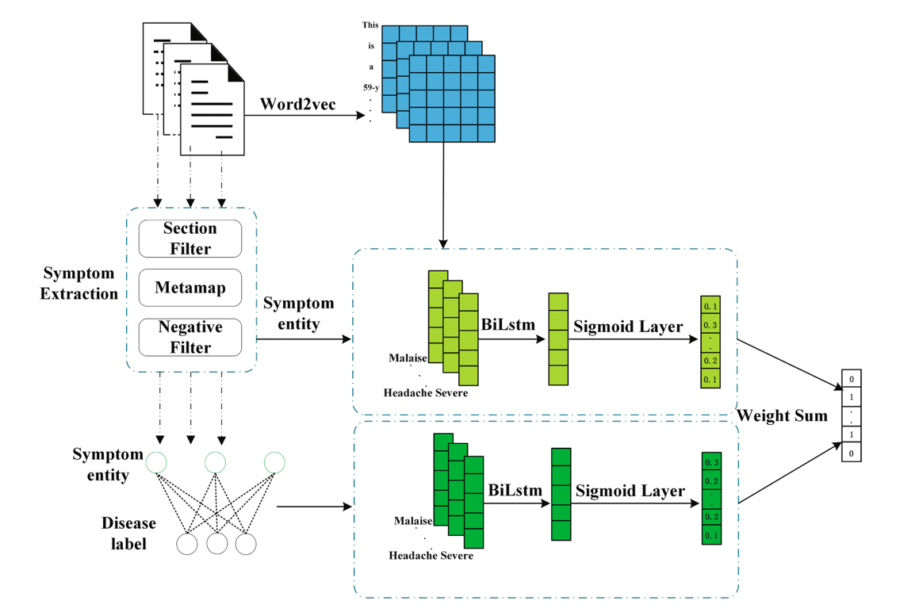
Source: https://pubmed.ncbi.nlm.nih.gov/31301375/

## 2.0 Requirements

### 2.1 Install Metamap (for symptom extraction)
- Download Metamap executables from https://lhncbc.nlm.nih.gov/ii/tools/MetaMap/run-locally/MainDownload.html

- Install Metamap locally using instructions at https://lhncbc.nlm.nih.gov/ii/tools/MetaMap/documentation/Installation.html

```shell
cd <metamap install folder>/public_mm

# Start Part-of-speech tagger server.
./bin/skrmedpostctl start

# Below command to stop Part-of-speech tagger server 
./bin/skrmedpostctl stop
```


### 2.2 Install pymetamap (python library to interact with Metamap)

- Download pymetamap from githum https://github.com/AnthonyMRios/pymetamap

- Execute following command in root folder of above project to install the package:

```setup
python3 setup.py install
```

### 2.3 To install python dependencies requirements:

```setup
pip install -r requirements.txt
```

### 2.4 Install and start Jupyter notebook
This project provides code in form of Jupyter notebook and thus Jupyter notebook needs to be run to work with the code.

```shell
# Install the classic Jupyter Notebook with:
pip install notebook

# To run the notebook:
jupyter notebook
```
## 3.0 Machine Learning Pipeline

### 3.1 Symptom Extraction - 01_symptom_extraction

Jupyter notebook implements symptom extraction functionality from raw discharge summary notes for demonstration. Python script pre_process_notes_multi.py was used for actual extraction. We executed symptom extraction process on google cloud (it took ~2000 cpu hours to process).

Note: We didn't use jupyter notebook for this processing as Metamap symptom extraction process requires significant processing power. 

---

- Input : NOTEEVENTS.csv - MIMIC-III dataset file containing clinical notes
- Output : symptoms.csv - Contains symptoms extracted from discharge summary using Metamap (used in 02 - data preparation)
- Output : discharge_summary.csv - Contains filtered discharge summary records from NOTEEVENTS.csv (used in 04 - word2vev training)


### 3.2 Data Preparation - 02_data_preparation

Here we will prepare the input dataset(X, Y) which will be used for training a NN model using Word2Vec representations and generating symptom representation using TF-IDF weights.

---

- Input  : symptoms.csv file generated by Symptom Extraction Module.
- Input  : DIAGNOSES_ICD.csv from MIMIC-III Dataset
- Output : symptom_disease_dict_{RUN_TAG}.json - Contains HADM_ID to Symptom text and Diagnosis mapping as json object
- Output : icd9_dict_{RUN_TAG}.json - Contains ICD9 Codes of TOP N Diagnoses
- Output : symptoms_dict{RUN_TAG}.json - Symptoms Dictionary with count of each symptom

### 3.3 TF-IDF Weights Calculation - 03_tf_idf_weights_calculation

Here we will calculate TF-IDF weights for symptoms as described in the paper. Symptom vector S<sub>i</sub> is as follows:

S<sub>i</sub> = (W<sub>i,1</sub>, W<sub>i,2</sub>, ... , W<sub>i,d</sub>),

where W<sub>i,j</sub> is strength of association between Symptom i and disease j. W<usb>i,j</sub> is calculated using TF-IDF as follows:

W<usb>i,j</sub> = TF<usb>i,j</sub> . log (N / D<sub>i</sub>),

Where N is the number of all diseases we take in consideration, D<sub>i</sub> is the number of diseases d associate with Symptom i, and TF<usb>i,j</sub> is the number of symptom i in the discharge summaries correlated with disease j.

---
- Input : symptom_disease_dict_{RUN_TAG}.json - Contains HADM_ID to Symptom text and Diagnosis mapping as json object
- Input : icd9_dict_{RUN_TAG}.json - Contains ICD9 Codes of TOP N Diagnoses
- Output : weight_i_j_norm{tag}.csv - TF-IDF weights for symptom representation

### 3.4 Training of Word2Vec model - 04_word2vec_symptoms_embeddings

This notebook takes the raw discharge summaries and trains Word2Vec model. Model is saved as a file and use during Symptom embedding generation using BiLSTM training in 05_bilstm_training notebook. 

---

- Input : discharge_summary.csv - Filtered notes file with raw discharge summary notes (generated by 01_symptom_extraction)
- Output : word2vec trained model - Used by 05_bilstm_training.

### 3.5 BiLSTM Training and evaluation - 05_bilstm_training_v2

This notebook implements the BiLSTM model which will take TF-IDF based symptom representation and Word2Vec based symptom representation and predicts diagnoses codes.

---

- Input : symptom_disease_dict_{RUN_TAG}.json - Contains HADM_ID to Symptom text and Diagnosis mapping as json object
- Input : icd9_dict_{RUN_TAG}.json - Contains ICD9 Codes of TOP N Diagnoses
- Input : weight_i_j_norm{tag}.csv - TF-IDF weights for symptom representation
- Input : word2vev/word2vec_model_sg_128__v2.0 - word2vec trained model
- Output : results_{RUN_TAG}.json.* - results files contains BiLSTM performance numbers (used for plotting charts) 

### 3.6 Ablation - LSTM Training and evaluation - 06_ablation_bilstm

This notebook is almost same as notebook 05_bilstm_training_v2 with minor changes to use LSTM instead of BiLSTM model as an ablation to original experiment. We added a separate notebook to be able to present all the charts etc. associated with experiment.

## 4.0 Pre-trained Models

models folders contains following pre-trained models:

- word2vec_model_sg_128__v2.0 : trained word2vec model.
- weight_i_j__100_v2.0.csv and weight_i_j_norm__100_v2.0 : TF-IDF weights for top 100 diseases
- symptom_diagnoses_100_v2.0.model : Symptom to Diagnoses (TF-IDF based symptom representation) trained BiLSTM model for top 100 diseases
- symptom_symptom_100_v2.0.model : Symptom to Symptom (Word2Vec embeddings based symptom representation ) trained BiLSTM model for top 100 diseases


## 5.0 Results

### 5.1 Top 100 Disease classification

#### 5.1.1 Performance of different models for 100 most-common diseases (micro average)

| Model name         | Mi-Precision  | Mi-Recall | Mi-F1 | Mi-AUC
| ------------------ |---------------- | -------------- |---------------|--------------|
| BiLSTM + SymVec (TF-IDF)   |     0.410   |   0.570    |   0.477   |   0.749   |
| BiLSTM + SymVec (Word2Vec)   |     0.458   |   0.604    |   0.521   |   0.771   |
| BiLSTM + SymVec (TF-IDF + Word2Vec)   |    0.455   |   0.613    |   0.522   |   0.774   |

#### 5.1.2 Micro F1 Score for Top 100 diseases for all 3 models for different weighted means
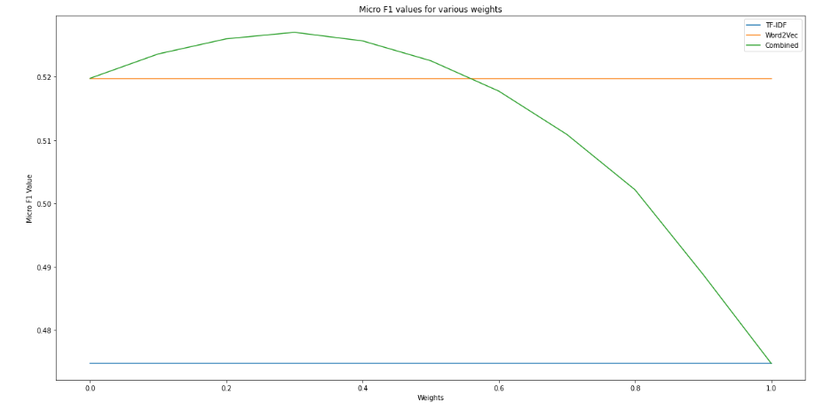

#### 5.1.3 Micro AUC Score for Top 100 diseases for all 3 models for different weighted means

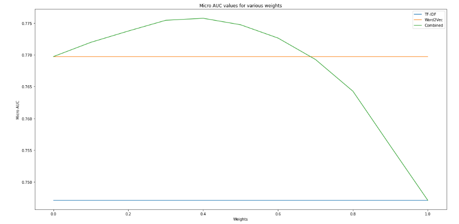

#### 5.1.4 Performance of different models for 100 most-common diseases (macro average)

| Model name         | Ma-Precision  | Ma-Recall | Ma-F1 | Ma-AUC
| ------------------ |---------------- | -------------- |---------------|--------------|
| BiLSTM + SymVec (TF-IDF)   |     0.370   |   0.439    |   0.367   |   0.679   |
| BiLSTM + SymVec (Word2Vec)   |    0.395   |   0.464    |   0.393   |   0.698   |
| BiLSTM + SymVec (TF-IDF + Word2Vec)   |    0.409   |   0.471    |   0.400   |   0.700   |

#### 5.1.5 Macro F1 Score for Top 100 diseases for all 3 models for different weighted means
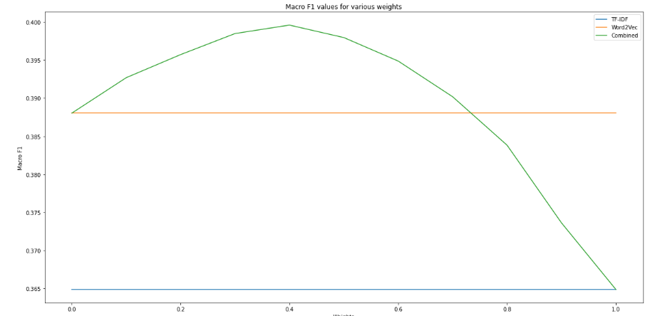

#### 5.1.6 Macro AUC Score for Top 100 diseases for all 3 models for different weighted means

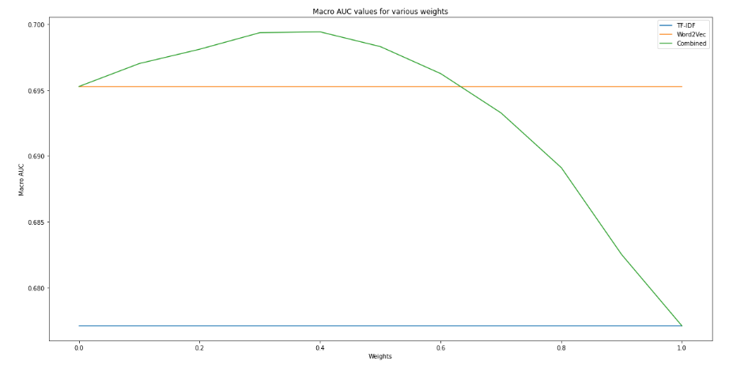

### 5.2 Top 50 Disease classification

#### 5.2.1 Performance of different models for 50 most-common diseases (micro average)

| Model name         | Mi-Precision  | Mi-Recall | Mi-F1 | Mi-AUC
| ------------------ |---------------- | -------------- |---------------|--------------|
| BiLSTM + SymVec (TF-IDF)   |     0.391        |      0.602       |    0.474     |       0.732    |
| BiLSTM + SymVec (Word2Vec)   |     0.457        |      0.671      |    0.544     |       0.777    |
| BiLSTM + SymVec (TF-IDF + Word2Vec)   |     0.459       |      0.686       |    0.550    |       0.783    |

#### 5.2.2 Micro F1 Score for Top 50 diseases for all 3 models for different weighted means
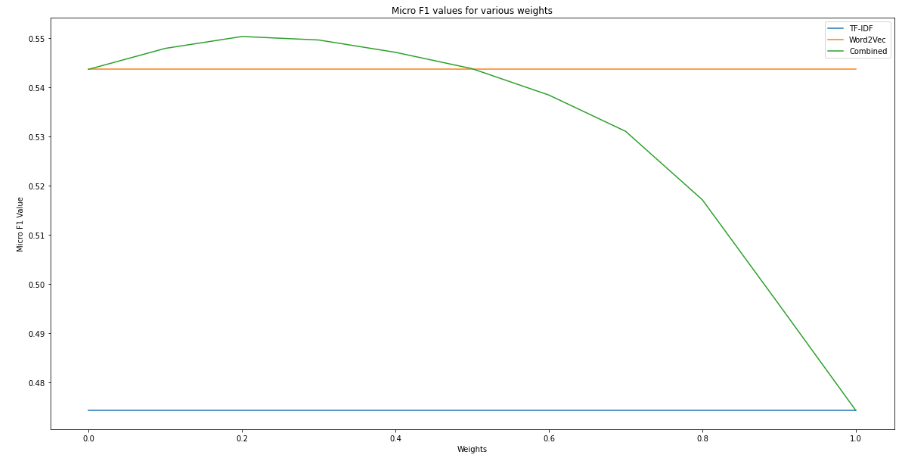

#### 5.2.3 Micro AUC Score for Top 50 diseases for all 3 models for different weighted means
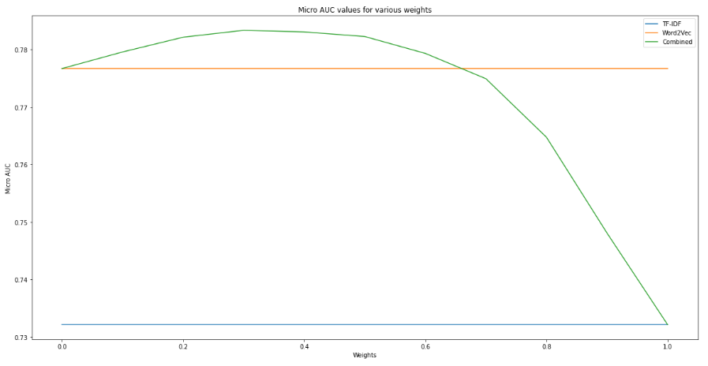

#### 5.2.4 Performance of different models for 50 most-common diseases (macro average)

| Model name         | Ma-Precision  | Ma-Recall | Ma-F1 | Ma-AUC
| ------------------ |---------------- | -------------- |---------------|--------------|
| BiLSTM + SymVec (TF-IDF)   |     0.353        |      0.481       |    0.390     |       0.664    |
| BiLSTM + SymVec (Word2Vec)   |     0.415        |      0.569       |    0.471     |       0.721    |
| BiLSTM + SymVec (TF-IDF + Word2Vec)   |     0.425        |      0.577       |    0.476     |       0.723    |

#### 5.2.5 Macro F1 Score for Top 50 diseases for all 3 models for different weighted means
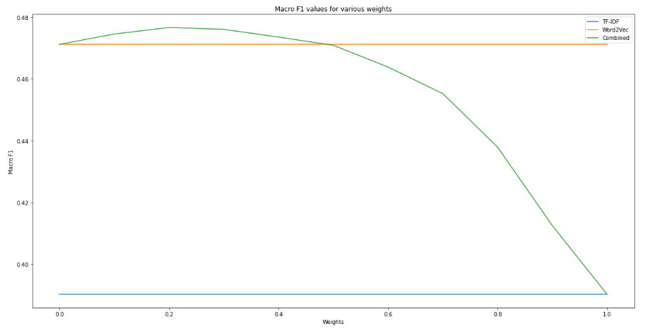

#### 5.2.6 Macro AUC Score for Top 50 diseases for all 3 models for different weighted means
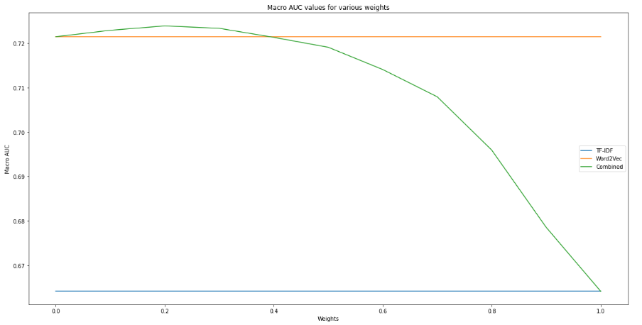


### 5.3 Ablation - using LSTM instead of BiLSTM - Top 100 Disease classification

#### 5.3.1 Ablation - Performance of different models for 100 most-common diseases (micro average)

| Model name         | Mi-Precision  | Mi-Recall | Mi-F1 | Mi-AUC
| ------------------ |---------------- | -------------- |---------------|--------------|
| BiLSTM + SymVec (TF-IDF)   |     0.40   |   0.50    |   0.44   |   0.72   |
| BiLSTM + SymVec (Word2Vec)   |    0.43   |   0.59    |   0.49   |   0.76   |
| BiLSTM + SymVec (TF-IDF + Word2Vec)   |    0.44   |   0.58    |   0.50   |   0.76   |

#### 5.3.2 Ablation - Micro F1 Score for Top 100 diseases for all 3 models for different weighted means
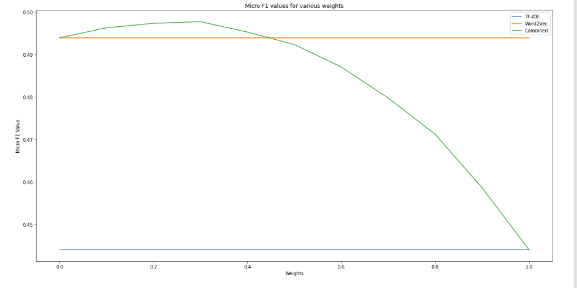

#### 5.3.3 Ablation - Micro AUC Score for Top 100 diseases for all 3 models for different weighted means
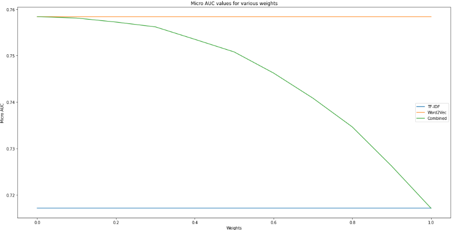

#### 5.3.4 Ablation - Performance of different models for 100 most-common diseases (macro average)

| Model name         | Ma-Precision  | Ma-Recall | Ma-F1 | Ma-AUC
| ------------------ |---------------- | -------------- |---------------|--------------|
| BiLSTM + SymVec (TF-IDF)   |    0.41   |   0.34    |   0.28   |   0.63   |
| BiLSTM + SymVec (Word2Vec)   |    0.35   |   0.44    |   0.36   |   0.68   |
| BiLSTM + SymVec (TF-IDF + Word2Vec)   |     0.38   |   0.43    |   0.36   |   0.68   |

## 6.0 Contributing

MIT License

